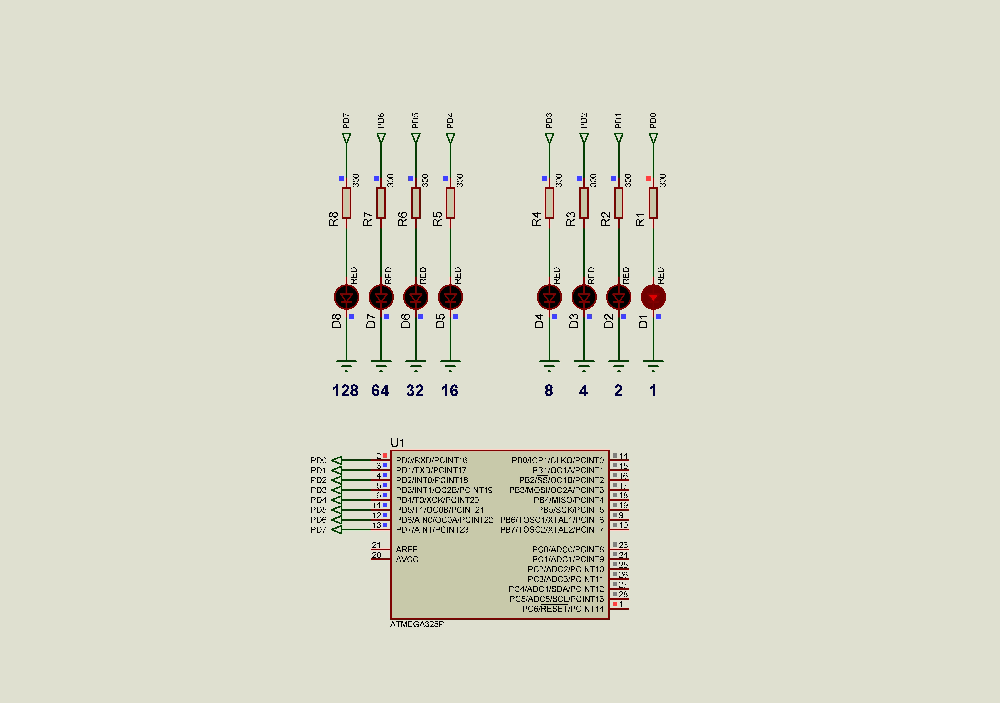

### Type Layout

The C language provides the four basic arithmetic type specifiers ***char***, ***int***, ***float*** and ***double***, and the modifiers ***signed***, ***unsigned***, ***short***, and ***long***.  Current solution allows to show different data type sizes using 8bit outbut of port D.  

|**Data type**                                                      |**Size (bytes)**|
|:------------------------------------------------------------------|:--------------:|
|**char** or **signed char**                                        |1|
|**unsigned char**                                                  |1|
|**int** or **signed int**                                          |2|
|**unsigned int**                                                   |2|
|**long int** or **long signed int** or **long**                    |4|
|**long unsigned int**                                              |4|
|**long long int** or **long long signed int** or **long long**     |8|
|**long long unsigned int**                                         |8|
|**short int** or **short signed int** or **short**                 |2|
|**short unsigned int**                                             |2|
|**float**                                                          |4|
|**double**                                                         |4|
|**long double**                                                    |4|
|**void**                                                           |1|
|**char \***                                                        |2|
|**int \***                                                         |2|
|**long \***                                                        |2|
|**long long \***                                                   |2|
|**float \***                                                       |2|
|**double \***                                                      |2|
|**void \***                                                        |2|

See also:  
- [C data types](https://en.wikipedia.org/wiki/C_data_types "C data types")  
- [GCC Wiki avr-gcc](https://gcc.gnu.org/wiki/avr-gcc#Type_Layout "Type Layout")

