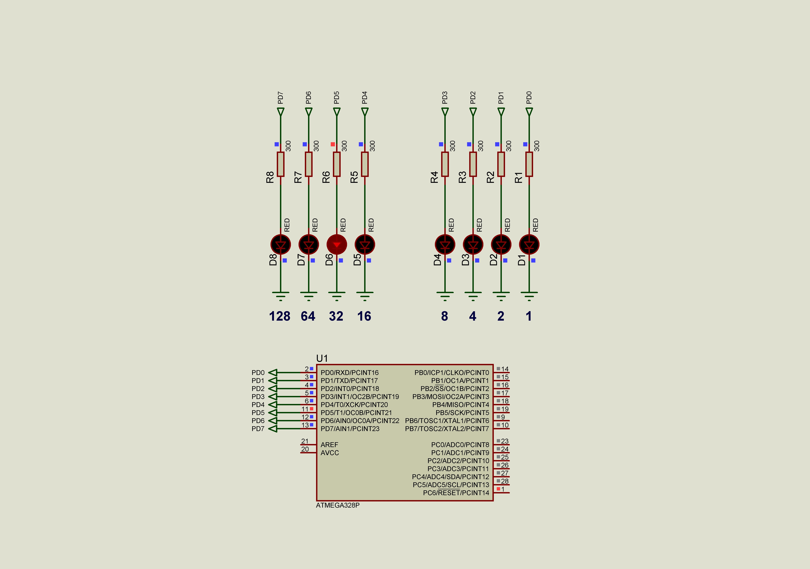

### Endianess

Endianess: Little
This means that complex data types with more than 1 byte size stores in memory as a sequence: from LSB to MSB.
Current solution introduces example with two bytes value 544 which has binary representation as [0000 0010] [0010 0000] or (512 + 32).
Where the Most Significant Byte (MSB) will be [0000 0010] and the Least Significant Byte (LSB) will be [0010 0000].  

See also:  
- [GCC Wiki avr-gcc](https://gcc.gnu.org/wiki/avr-gcc#Type_Layout "Type Layout")

