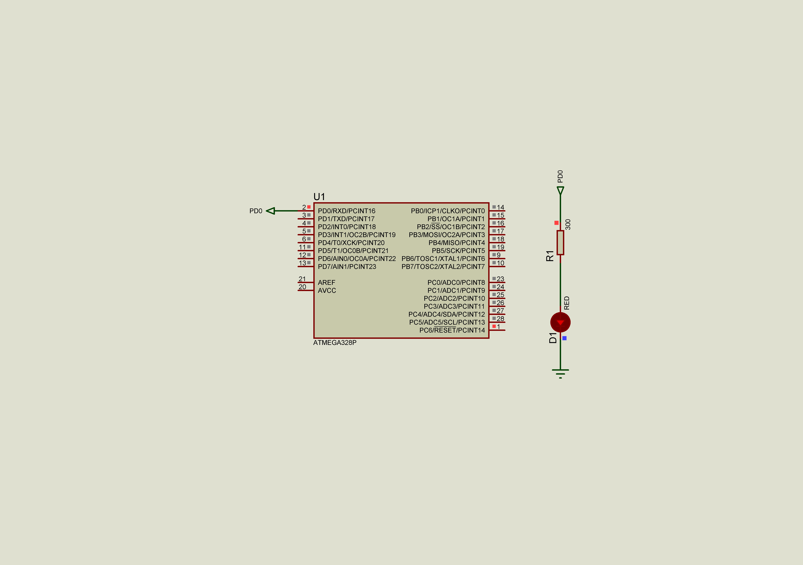

### Delay

The current solution shows how the visual perception changes when the LED blinks with different frequencies.  

#### Below represented C code fragment with toggling LED pin WITHOUT delay 
 ```c
    while (1) 
    {
        PORTD ^= _BV(PIND0);
    }
 ```  
#### Appropriate assembly listing:  
```assembly
00000000 <main>:
   0:   50 9a           sbi     0x0a, 0 ; 10  
   2:   58 9a           sbi     0x0b, 0 ; 11  
   4:   91 e0           ldi     r25, 0x01       ; 1
   6:   8b b1           in      r24, 0x0b       ; 11
   8:   89 27           eor     r24, r25
   a:   8b b9           out     0x0b, r24       ; 11
   c:   fc cf           rjmp    .-8             ; 0x6 <__zero_reg__+0x5>
```  
Instruction 0: configures PIN0 of DDRD to output  
Instruction 2: configures PIN0 of PORTD driven high  
Instruction 4: load data to the register r25 (will be a bitmask)  
Instruction 6: write value of PORTD to the register r24  
Instruction 8: apply exclusive OR between registers r24 and r25 (write result to the register r24)  
Instruction a: write value of the register r24 to the PORTD  
Instruction c: jump to the instruction with address 0x6  

It is possible highlight two parts of the firmware:  
instructions [00 ; 04] - initializing part  
instructions [06 ; 0c] - main superloop

#### Below represented C code fragment with toggling LED pin WITH some delay 
 ```c
    while (1) 
    {
        _delay_us(PERIOD);
        PORTD ^= _BV(PIND0);
    }
 ```
#### Appropriate assembly listing:  
 ```assembly
 00000000 <main>:
   0:   50 9a           sbi     0x0a, 0 ; 10
   2:   58 9a           sbi     0x0b, 0 ; 11
   4:   91 e0           ldi     r25, 0x01       ; 1
   6:   2f e9           ldi     r18, 0x9F       ; 159
   8:   36 e8           ldi     r19, 0x86       ; 134
   a:   81 e0           ldi     r24, 0x01       ; 1
   c:   21 50           subi    r18, 0x01       ; 1
   e:   30 40           sbci    r19, 0x00       ; 0
  10:   80 40           sbci    r24, 0x00       ; 0
  12:   e1 f7           brne    .-8             ; 0xc <__zero_reg__+0xb>
  14:   00 c0           rjmp    .+0             ; 0x16 <__zero_reg__+0x15>
  16:   00 00           nop
  18:   8b b1           in      r24, 0x0b       ; 11
  1a:   89 27           eor     r24, r25
  1c:   8b b9           out     0x0b, r24       ; 11
  1e:   f3 cf           rjmp    .-26            ; 0x6 <__zero_reg__+0x5>
  ```
Similar to the previous example we can highlight two parts of a programm:  
instructions [00 ; 04] - initializing part  
instructions [06 ; 1e] - main superloop  
Moreover, instructions [06 ; 16] form delay before toggling a led and instructions [18 ; 1e] toggle a LED pin itself.  

See also:  
- [AVR Instruction Set Manual](http://ww1.microchip.com/downloads/en/devicedoc/atmel-0856-avr-instruction-set-manual.pdf)  


