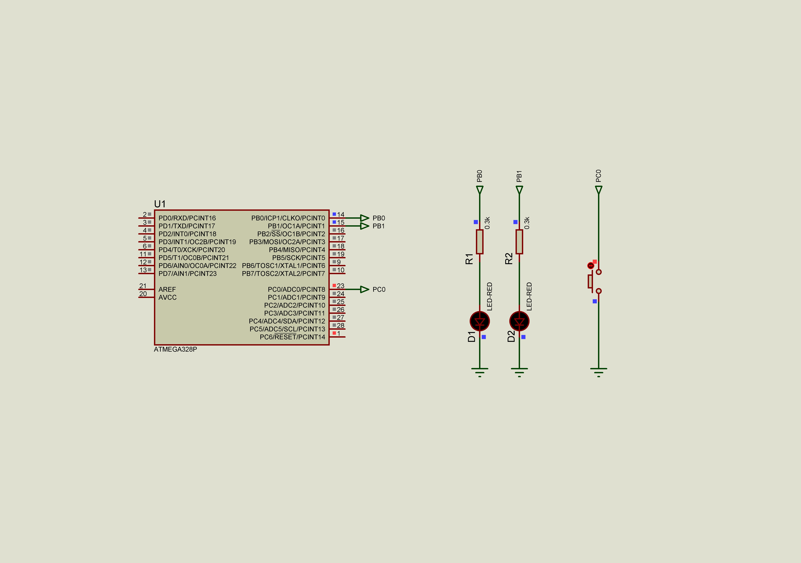
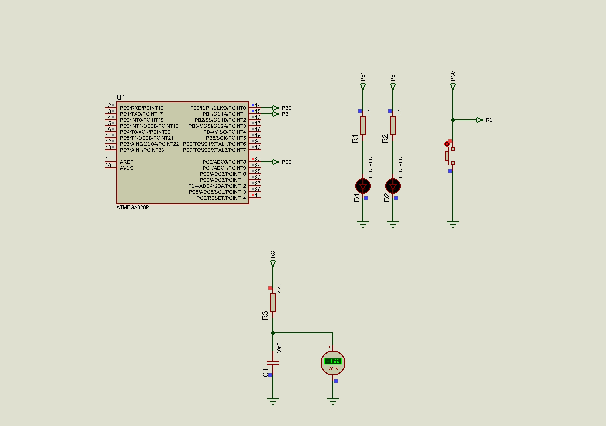
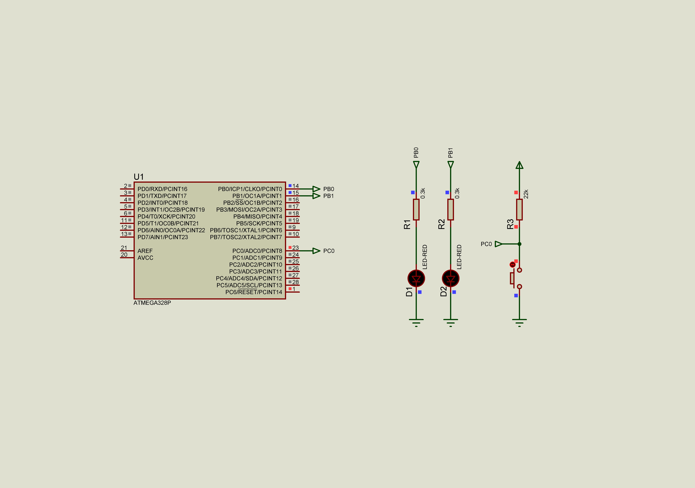
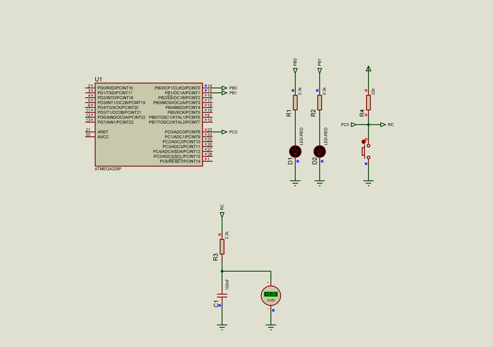

### Button

This solution contains several examples with buttons.  

Example 01 - INTERNAL PULL-UP resistor is used  
*SIMULATION: No simulation issues in Proteus*  
*REALTIME: The start is fine. Several hits on the button are accompanied by a bounce*  

  

Example 02 - INTERNAL PULL-UP resistor is used, R = 2.2kΩ and C = 0.1µF is used for debouncing  
*SIMULATION: leds is turned on at the beginning of a simulation in Proteus*  
*REALTIME: The start is incorrect: leds is turned on at the beggining. RC solution for debounce is fine*  
**FIX: the capacitor needs some time to become fully charged, so after internal pull-up resistor activation some delay is needed**  

  

Example 03 - EXTERNAL PULL-UP resistor R = 22kΩ is used  
*SIMULATION: No simulation issues in Proteus*  
*REALTIME: The start is fine. Several hits on the button are accompanied by a bounce, ignoring the pull-up resistor leads to the high-impedance state of a button pin, and LEDs start to blink randomly*  

  

Example 04 - EXTERNAL PULL-UP resistor R = 22kΩ is used, R = 2.2kΩ and C = 0.1µF is used for debouncing  
*SIMULATION: No simulation issues in Proteus*  
*REALTIME: The start is fine. RC solution for debounce is fine, ignoring the pull-up resistor leads to the high-impedance state of a button pin, and LEDs start to blink randomly*  

  

See also:  
- [11 Myths About Switch Bounce/Debounce](https://www.electronicdesign.com/technologies/analog/article/21155418/logiswitch-11-myths-about-switch-bouncedebounce)  
- [A Guide to Debouncing](https://my.eng.utah.edu/~cs5780/debouncing.pdf)  
- [Debounce a Switch](https://www.youtube.com/watch?v=e1-kc04jSE4&t)  
