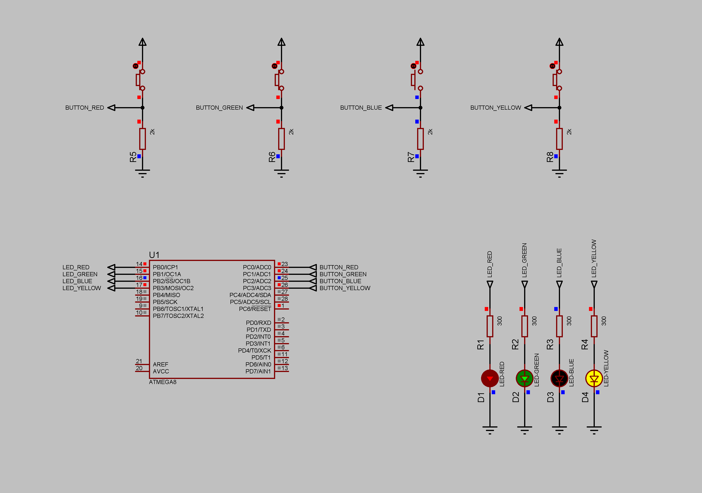

### Button project

Four buttons on port C correspond to four LEDs on port B.  
Each button turns on a corresponding LED.  
Current limiting resistors - 300 Ohm.  
Pull-down resistors - 2000 Ohm.  
Supply voltage - 5V.  

